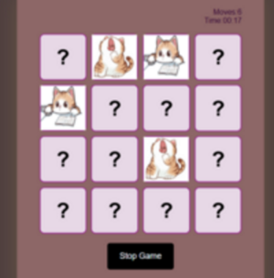
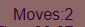
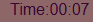
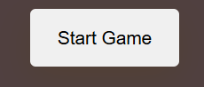
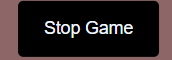
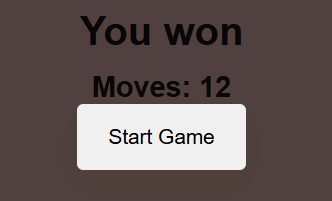

#   Cat Memory card game ! 


  


## How to play the game?

The game starts with all the cards face down and players take turns to turn over **two cards**. If the two cards have the same picture, then they keep the cards, otherwise they turn the cards face down again. The winner is the person with the most cards when all the cards have been taken


## structure of the game 

```javascript 
const moves =document.getElementById("moves-count");
const timeValue =document.getElementById("time");
const startButton =document.getElementById("start");
const stopButton =document.getElementById("stop");
const resetButton =document.querySelector(".game-container");
const gameContainer =document.querySelector(".game-container");
const result =document.getElementById("result");
const controls =document.querySelector(".controls-container");
 
```
## why used them?

 * **Moves-Count** : for displaying the moves and how many moves have the player moved.



* **Time** : of course for displaying the time that the player spend at each game .



* **Start** : start button to start the Game at the ery begining 



* **Stop** : stop button for stoping the game anyTime the player desire .



* **Game-Container** : this is the container or the wrapper that contains the reset button and all the cards and functionality , including the stop button .

* **Result** : will display the result after and while the game is in procces 




 ### [The memory game](http://127.0.0.1:5501/)